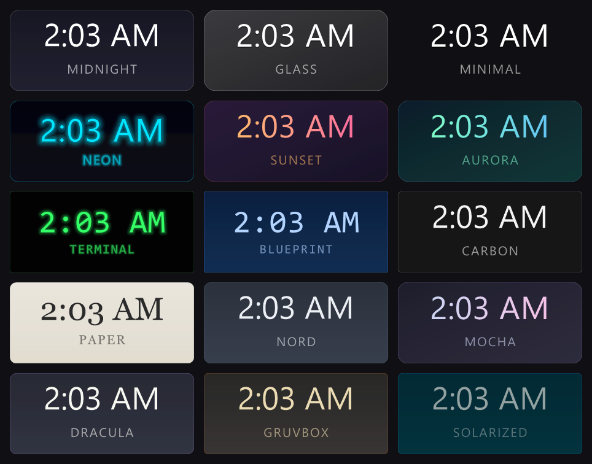
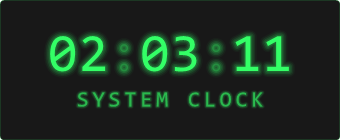
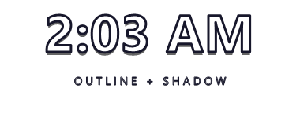
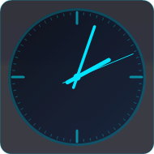
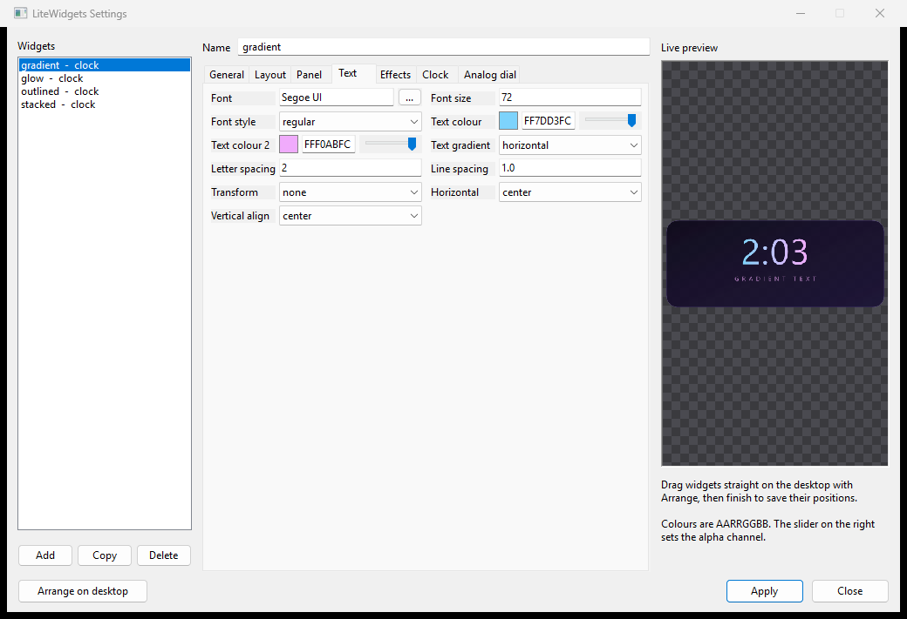

# LiteWidgets

Desktop widgets for Windows that stay out of the way — of your screen, and of
your CPU.

Written in pure C17 against raw Win32 and GDI+. No runtime to install, no
dependencies to vendor, one executable and one text file.



---

## What it does

- **Lives on the desktop layer.** Widgets sit above your wallpaper and behind
  your windows. Win+D and "show desktop" don't touch them.
- **Stays out of the way of clicks.** Input passes straight through to the
  desktop icons underneath.
- **Sleeps between updates.** A clock showing hours and minutes wakes up once
  a minute, not sixty times. Seconds and animation are opt-in, and only then
  does it tick faster.
- **Plays nicely with live wallpapers.** It doesn't reparent itself into
  `WorkerW`, which is what makes Wallpaper Engine reload its scene.
- **Configures itself from one INI file** — or from a settings editor with a
  live preview, if you'd rather not hand-edit hex colours.
- **Per-monitor DPI aware**, with anchors so a config survives a resolution
  change or a move to a different machine.

## Widgets

| Type | What it is |
| --- | --- |
| `clock` | Digital or analog. Custom time and date patterns, locale-aware day and month names, optional seconds, blinking separator, sweeping second hand. |
| `notes` | Renders a text file. Optionally re-reads it when the file changes. |
| `image` | A PNG/JPEG, fitted with `contain`, `cover` or `stretch`, clipped to the panel's rounded corners. |

## Styling

Everything visual is a config key, and every key works on every widget that
has text.

| | |
| --- | --- |
|  | Linear gradients on the panel **and** on the text, in four directions |
|  | Glow, plus a separator that dims on odd seconds |
|  | Glyph outlines and drop shadows, with no panel at all |
|  | Analog dials: ticks, rings, hand widths, sweep |

Also: corner radius, borders, letter spacing, line spacing, case transforms,
alignment, padding, per-widget opacity, and **15 built-in presets** —
`midnight`, `glass`, `minimal`, `neon`, `sunset`, `aurora`, `terminal`,
`blueprint`, `carbon`, `paper`, `nord`, `mocha`, `dracula`, `gruvbox`,
`solarized`.

A preset is just a bundle of defaults, so you can start from one and override
only what you want:

```ini
[clock]
type=clock
preset=neon
font_size=72
glow_radius=14        ; the preset's glow, but stronger
```

## Settings

Right-click the tray icon, or double-click it, for a visual editor. It's built
from the same property table the config parser uses, so it can never fall
behind the file format.



The preview on the right calls the *same painter* the desktop does, so what
you see is exactly what you get — including transparency, which is why it's
drawn over a checkerboard.

**Arrange on desktop** makes every widget draggable in place, snapped to an
8px grid, and writes the positions back as anchor-relative offsets when you're
done.

## Install

Grab `LiteWidgets.exe` and the `config` folder from
[Releases](../../releases), put them side by side, and run it. It lands in the
system tray.

To start it with Windows, tick **Start with Windows** in the tray menu — it
writes a single value under `HKCU\...\CurrentVersion\Run` and removes it again
when you untick it.

### Build it yourself

Needs Visual Studio with the "Desktop development with C++" workload.

```bat
build.bat
```

That's it — `build.bat` finds and initialises MSVC itself. The result is
`bin\LiteWidgets.exe`, statically linked, no redistributable required.

CMake works too:

```bat
cmake -B build && cmake --build build --config Release
```

## Configuration

Widgets live in `config/widgets.ini`, which the app creates on first run from
the tracked `config/widgets.example.ini`. The live file is deliberately not in
git, so your own layout never shows up as a change to the repository.

One `[section]` per widget:

```ini
[clock]
type=clock
preset=midnight
anchor=top_right
x=-60
y=64
width=360
height=156
font_size=66
time_format=h:mm tt
date_format=dddd, d MMMM
date_transform=upper
date_letter_spacing=3
```

`x` and `y` are offsets from the `anchor`, not absolute coordinates, so
`top_right` with `x=-60` stays 60px from the right edge whatever the screen
does.

**[Full key reference →](docs/CONFIGURATION.md)** (generated from the source,
so it can't drift)

**[Example configs →](examples/)**

## Command line

```
LiteWidgets.exe [--config <path>] [--settings]
```

`--config` points at a specific INI; `--settings` opens the editor on start.
Launching a second copy tells the running one to reload instead of stacking
duplicate widgets.

## Resource use

Windows 11, release build, measured in steady state:

| Config | Private bytes | CPU |
| --- | --- | --- |
| One clock, hours and minutes | 3.9 MB | 0.000 s over 90 s |
| Four widgets, one ticking every second with a glow | 4.9 MB | 0.31 s over 60 s (0.5% of a core) |

The first row is the point. A clock that only shows hours and minutes has
nothing to do for 59 of every 60 seconds, so it does nothing — the timer is
armed for the next minute boundary rather than polling. Cost scales with how
often you've asked something to change, not with how many widgets are on
screen.

## How it works

Widgets are layered `WS_POPUP` windows, painted into a premultiplied ARGB
bitmap with GDI+ and pushed to the screen with `UpdateLayeredWindow`. Config
is parsed into one typed struct, and painting is a pure function of that
struct — which is how the settings preview, the desktop, and the offscreen
renderer all stay pixel-identical.

**[Architecture notes →](docs/ARCHITECTURE.md)**

## Contributing

Bug reports and pull requests are welcome. Desktop integration is the fragile
part, so please mention your Windows version, monitor layout, display scaling,
and any wallpaper software you run.

**[Contributing guide →](CONTRIBUTING.md)**

## License

MIT. See [LICENSE](LICENSE).
